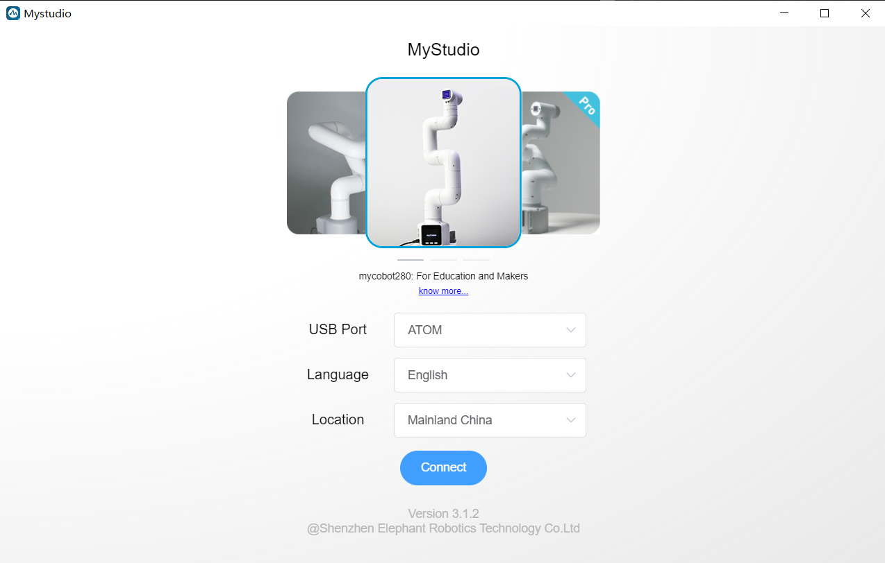
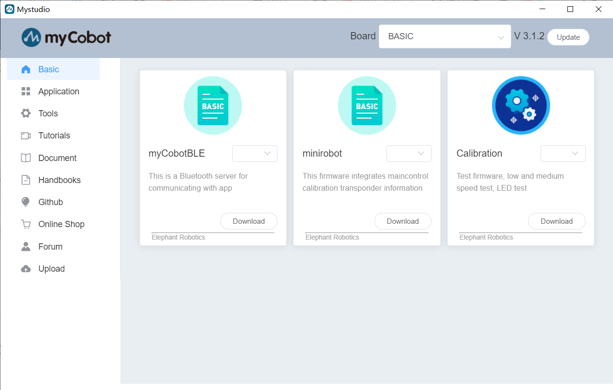
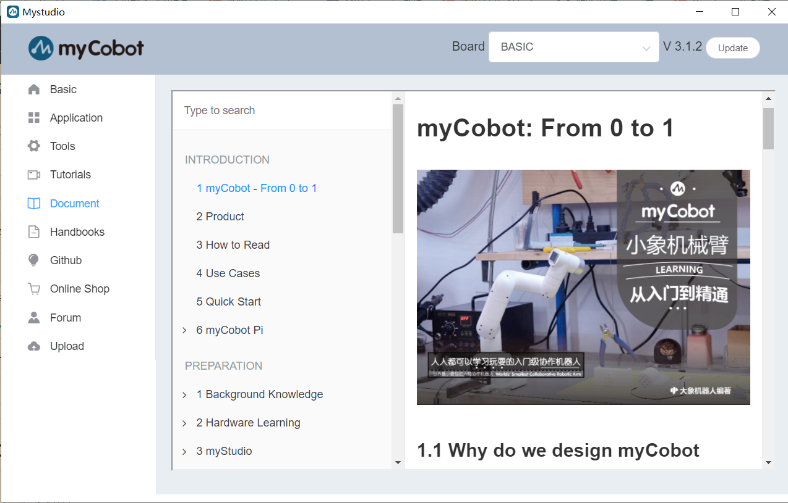

# MyStudio

## Installation

Download from [GitHub Releases](https://github.com/elephantrobotics/MyStudio/releases) and install it.

You can also [download](https://www.elephantrobotics.com/myCobot/#myStudio) the software from the official website.

## How to use

**For Windows or MacOS**

You can download `.exe` to install the software.

**For MacOS**

You can download `.dmg` to install the software.

**For Linux**

Enter the `uname - m` command in the command line to check the hardware architecture of the current system.

If it is x86_64:
Decompression software. Open a terminal, enter the unzipped directory, and run `sudo ./myStudio-xxx.AppImage`.

If it is aarch64:
Decompression software. Open a terminal, enter the unzipped directory, and run `sudo ./myStudio-xxx-arm64.AppImage`.

## Open Source Firmware Flashing

If you would like an open-source host-side flashing process, please see:  
<https://github.com/zlj-zz/minimycobotflasher>

Please note that this tool will still download proprietary firmware binaries.
