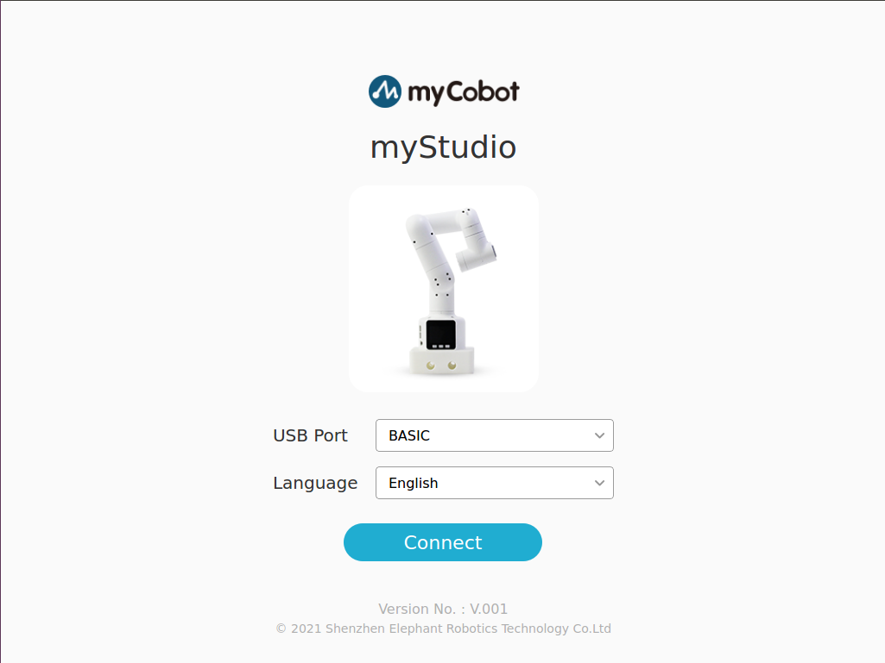
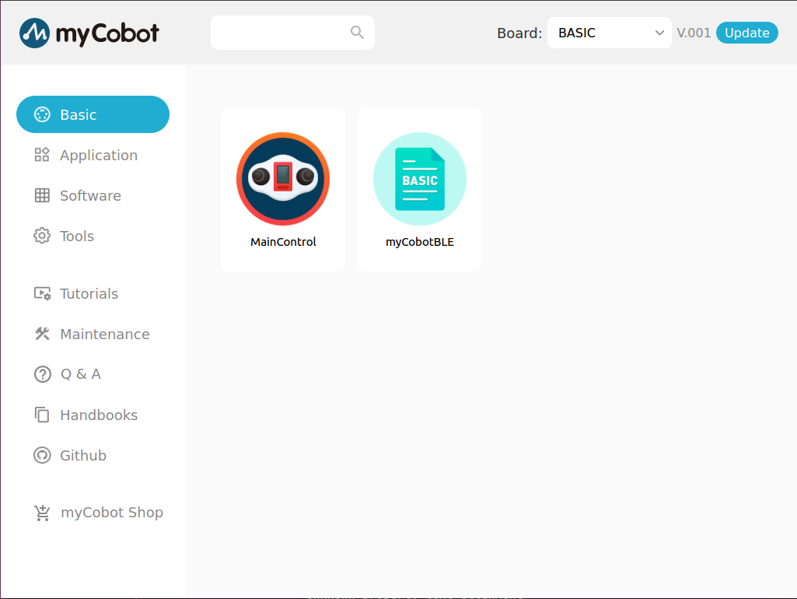

# MyStudio

## Installation

Download from [GitHub Releases](https://github.com/elephantrobotics/MyStudio/releases) and install it.

## How to use

**For Windows or MacOS**

You can download `exe` to install the software.

At the same time, we also provide the installation free version. Unzip the `zip`, find `MyStudio.exe`, double-click to run.

**For MacOS**

Unzip the software, find `MyStudio`, double-click to run.

**For Linux**

Decompression software. Open a terminal, enter the unzipped directory, and run `./MyStudio`.
